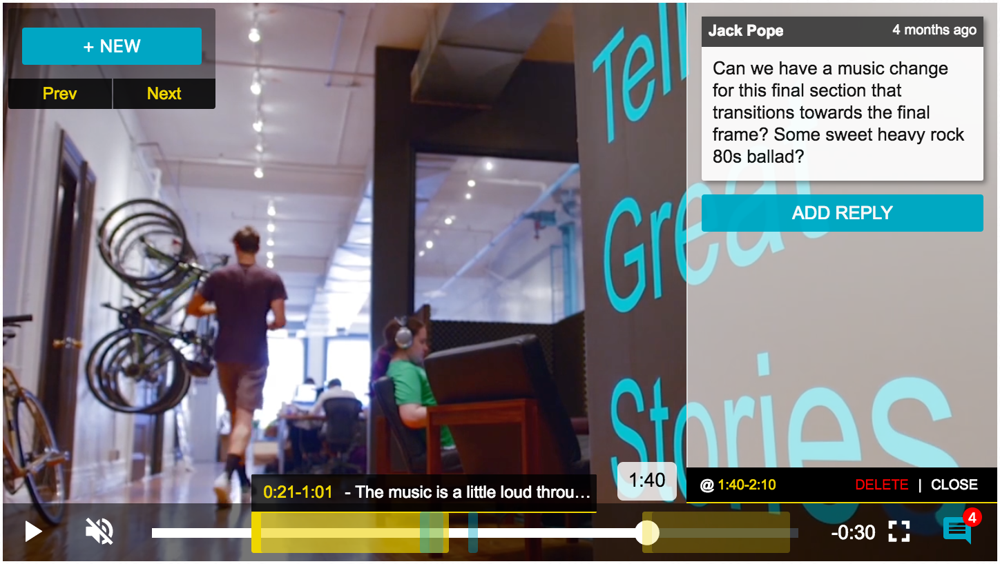

[](https://circleci.com/gh/contently/videojs-annotation-comments/tree/master)

# AnnotationComments : Collaborate in your VideoJS player



>## Upgrading v1 -> v2
>Please note that the event based API has changed. In version 1, you can subscribe to plugin events with `pluginInstance.on()`. In version 2, the same functionality is available with `pluginInstance.registerListener()`. The following docs are for the latest version.

## About

### Background

Collaboration between videographers and clients can be tedious, with emails and phone calls that waste time trying to reference specific frames and areas of the screen. This plugin enables more efficient collaboration from the browser.

This plugin was conceived and developed as a Hack Week project at [Contently](http://www.contently.com) by [Evan Carothers](http://www.github.com/ecaroth) and [Jack Pope](http://www.github.com/jackpope). Continuing our focus and commitment to multimedia support at Contently, the entire team productized and bulletproofed the plugin as a flexible solution to be used in our product and other open-source use cases.

 ### Goals

- **Efficient for videographers and clients alike** - Provides useful collaboration features including annotations, comments/replies, ranged time markers, and more, with intuitive controls.
- **SIMPLE & LIGHTWEIGHT** - Everything is contained within the plugin and player element. There is no need to build additional UI components. Just install VideoJS, register the plugin, setup whatever backend storage you wish, and start collaborating.
- **EXTENSIBLE** - The plugin can be integrated with existing commenting systems (as we did within Contently), and makes very few assumptions about how to store annotations. Custom events are available for communicating with external APIs, providing support for on-page interactions and data persistence. Simple CSS overrides can also allow for branding customizations with minimal effort, or completely custom UI/UX.

### VideoJS Plugins

[VideoJS](http://videojs.com/) is a popular open-source HTML5 video player library used by 400k+ sites. As of v6, there is an extendable plugin architecture which was used to create this plugin. This plugin is built and tested against [VideoJS v7](https://www.npmjs.com/package/video.js/)

## Use it!

### Install

```
yarn add @contently/videojs-annotation-comments
```

OR

```
npm install @contently/videojs-annotation-comments
```
### Add it to your VideoJS player

#### As a script from build

```javascript
// ...videojs & videojs-annotation-comments have been loaded in script tags...
var player = videojs('video-id');
var plugin = player.annotationComments(pluginOptions)
```

#### As a module

```javascript
import videojs from 'video.js'
import AnnotationComments from '@contently/videojs-annotation-comments'
 videojs.registerPlugin('annotationComments', AnnotationComments(videojs))
 var player = videojs('video-id')
var plugin = player.annotationComments(pluginOptions)
```

### Plugin options / configuration

When initializing the plugin, you can pass in an options array to override default options. Any excluded options are set to their default values, listed below:

```javascript
const pluginOptions = {
    // Collection of annotation data to initialize
    annotationsObjects: [],
    // Flexible meta data object (currently used for user data, but addl data can be provided to wrap each comment with metadata - provide the id of the current user and fullname of the current user at minimum, which are required for the UI)
    meta: { user_id: null, user_name: null },
    // Use arrow keys to move through annotations when Annotation mode is active
    bindArrowKeys: true,
    // Show or hide the control panel and annotation toggle button (NOTE - if controls are hidden you must provide custom UI and events to drive the annotations - more on that in "Programmatic Control" below)
    showControls: true,
    // Show or hide the comment list when an annotation is active. If false, the text 'Click and drag to select', will follow the cursor during annotation mode
    showCommentList: true,
    // If false, annotations mode will be disabled in fullscreen
    showFullScreen: true,
    // Show or hide the tooltips with comment preview, and annotation shape, on marker hover or timeline activate
    showMarkerShapeAndTooltips: true,
    // If false, step two of adding annotations (writing and saving the comment) will be disabled
    internalCommenting: true,
    // If true, toggle the player to annotation mode immediately after init. (NOTE - "annotationModeEnabled" event is not fired for this initial state)
    startInAnnotationMode: false
};
```

### Annotation Data Structure

To initialize the plugin with the `annotationsObjects` collection, use the following structure:
```javascript
const annotationsObjects = [{
    id: 1,
    range: {
        start: 10,
        end: 15
    },
    shape: {
        x1: 23.47,
        y1: 9.88,
        x2: 60.83,
        y2: 44.2
    },
    comments: [{
        id: 1,
        meta: {
            datetime: '2017-03-28T19:17:32.238Z',
            user_id: 1,
            user_name: 'Jack Pope'
        },
        body: 'The first comment!'
    }]
}];
```

### Programmatic Control

If you'd like to drive the plugin or render plugin data through external UI elements, you can configure the plugin to hide the internal components and pass data through custom events. There are two kinds of AnnotationComments API events, _externally fired_ and _internally fired_.

#### Waiting for Plugin Ready

Before triggering any events on the plugin, you must wait for it to be ready. You can use the `onReady` function on the plugin:

```javascript
plugin.onReady(() => {
    // do stuff with the plugin, such as fire events or setup listeners
});
```

#### Supported Externally Fired Events:

 These events are external actions that can be called from your scripts to trigger events within the plugin:

```javascript
// openAnnotation : Opens an annotation within the player given an ID
plugin.fire('openAnnotation', { id: myAnnotationId });
 // closeActiveAnnotation : Closes any active annotation
plugin.fire('closeActiveAnnotation');
 // newAnnotation : Adds a new annotation within the player and opens it given comment data
plugin.fire('newAnnotation', {
    id: 1,
    range: { start: 20, end: null },
    shape: { // NOTE - x/y vals are % based (Floats) in video, not pixel values
        x1: null,
        x2: null,
        y1: null,
        y2: null
    },
    commentStr: "This is my comment."
});
 // destroyAnnotation : Removes an annotation and it's marker within the player given comment data
plugin.fire('destroyAnnotation', { id: 1 });
 // newComment : Adds a new comment to an Annotation given an Annotation ID and a body
plugin.fire('newComment', { annotationId: 1, body: "My comment string" });
 // destroyComment : Removes a comment from an Annotation given a Comment ID
plugin.fire('destroyComment', { id: 1 });
 // addingAnnotation : Plugin enters the adding annotation state (adding an annotation at the current player timestamp)
plugin.fire('addingAnnotation');
 // cancelAddingAnnotation : Plugin exits the adding annotation state
plugin.fire('cancelAddingAnnotation');
 // toggleAnnotationMode : toggle annotation mode to alternative on/off value
plugin.fire('toggleAnnotationMode');
```

#### Supported Internally Fired Events:
These are events that are triggered from within the running plugin and can be listened for by binding to `plugin.registerListener` within your scripts:

 ```javascript
// annotationOpened : Fired whenever an annotation is opened
plugin.registerListener('annotationOpened', (event) => {
    // event.detail =
    // {
    //      annotation: (object) annotation data in format {id:.., comments:..., range:..., shape:...},
    //      triggered_by_timeline: (boolean) TRUE = the event was triggered via a timeline action (like scrubbing or playing), FALSE = the annotation was opened via marker click, UI button interactions, or API/event input
    // }
});
 // annotationClosed : Fired whenever an annotation is closed
plugin.registerListener('annotationClosed', (event) => {
    // event.detail = annotation (object) in format {id:.., comments:..., range:..., shape:...}
});
 // addingAnnotationDataChanged : Fired from adding annotation state if:
//  1. the marker is dragged
//  2. the start of the marker is moved via control buttons
//  3. the shape is dragged
plugin.registerListener('addingAnnotationDataChanged', (event) => {
    var newRange = event.detail.range; // returns range data if range was changed
    var newShape = event.detail.shape; // returns shape data if shape was changed
    // do something with the data
});
 // annotationDeleted : Fired when an annotation has been deleted via the UI
plugin.registerListener('annotationDeleted', (event) => {
    // annotationId = event.detail
});
 // enteredAnnotationMode : Fired when the plugin enters adding annotation mode
// includes initial range data
plugin.registerListener('enteredAddingAnnotation', (event) => {
    var startTime = event.detail.range.start;
    // do something when adding annotation state begins
});
 // onStateChanged: Fired when plugin state has changed (annotation added, removed, etc)
// This is a way to watch global plugin state, as an alternative to watching various annotation events
plugin.registerListener('onStateChanged', (event) => {
    // event.detail = annotation state data
});
 // playerBoundsChanged : Fired when the player boundaries change due to window resize or fullscreen mode
plugin.registerListener('playerBoundsChanged', (event) => {
    var bounds = event.detail;
    // do something with the new boundaries
});
 // Entering annotation mode (annotation icon was clicked when previously 'off')
plugin.registerListener('annotationModeEnabled', (event) => {
    // do something
});
 // Exiting annotation mode (annotation icon was clicked when previously 'on')
plugin.registerListener('annotationModeDisabled', (event) => {
    // do something
});
```

## Develop and Build

We're using [yarn](https://yarnpkg.com/en/) for package management and [gulp](https://github.com/gulpjs/gulp) as our build system.

The fastest way to get started:
- Clone the repo
- Run `yarn install`
- Run `yarn build`
- Run `yarn watch`
- Visit `http://localhost:3004/test.html` to see the magic happen.

### Templates

 We're using the [Handlebars](http://handlebarsjs.com/) templating library to render various components within the plugin. For performance, the templates are pre-compiled into a JS file within the development environment. That way we only need to require the Handlebars runtime, saving nearly 100kb from the minified build! ⚡️

The `gulp templates` task is used to precompile every template to `/src/js/compiled/templates.js`. This file should _not_ be modified directly, but rather the templates themselves in `/src/templates` should be modified if changes are needed. The templates task will run automatically within `gulp watch`.


### UI / CSS Customization

The plugin uses SASS and all styles are defined in [annotaitons.scss](src/css/annotations.scss). There is extenssive commenting on classes and styles in the file. The plugin uses a deep level of specificity to prevent styles from polluting elements on the page, and all classes are prefixed with `vac-` to prevent classname collisions in the global namespace.

You can extend/modify colors and elements quite easily by writing an overrides stylesheet to address the specific elements that you wish to modify. You can also change the variable colors in the stylesheet and compile yourself for more customization.

_NOTE_ - our gulp build tasks use an auto-prefixer to make the styles work cross-browser, so be sure to run that yourself if you compile the SASS files with changes.

### Testing

#### Feature tests

Feature tests are currently browser-based and run by visiting `http://localhost:3004/mocha/features/index.html`. Feature tests can be added as files in the `/test/mocha/features/` directory and then included within the `index.html` file as a external scripts.

#### Unit tests

Unit tests are run through the `gulp test` task. If the `tdd` task is included in `gulp watch`, the tests will run with every change to the test files. Each module should have a corresponding unit test file within the `/test/mocha/modules` directory.

### Gulp commands

`gulp watch`: Fires up webserver @ `http://localhost:3004/test.html`, watches for any file changes in `/src`, including js, css (scss), and templates (.hbs), repackages, and transpiles to an unminified file in `/build` on change.

`gulp transpile`: Transpiles modules/files to build file in `/build` with JS maps

`gulp build`: Runs transpilation, browserify, sass, then minifies to distribution filename in `/build` with attribution

`gulp templates`: Uses Handlebars to pre-compile templates into a javascript file. See Templates section above.

`gulp test`: Runs the mocha unit tests within the `/test/mocha/modules/` directory.

`gulp lint`: Runs jshint linter on javascript files in `/src`

### License

This plugin is [licensed](license.md) under the Apache License, Version 2.0, which is the same license used by Video.js
